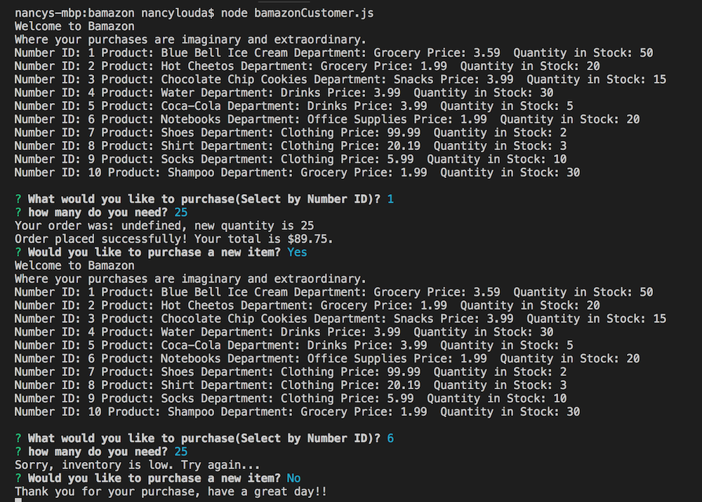

# bamazon
Is an Amazon-like storefront using MySQL.

**What it does:**

The app is run in node.js CLI to take orders from a customer and deplete stock from the store's inventory.

- Customer is prompted to choose a product they would like to purchase
- Customer is prompted to choose quantity of product they would like to purchase

The app runs in the background checking if the product requested has the quantity requestied. 
The Customer receives one of two responses:

- Successful transaction and amount owed
- Unsuccesful transaction and the request to try again.

After purchase the customer is asked if they would like to continue shopping and the app closes. 

